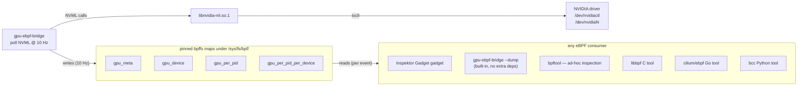

# gpu-ebpf-bridge

**Userspace daemon that polls GPU telemetry and publishes it through pinned eBPF maps, so eBPF programs (gadgets, tracers, custom probes) can enrich their events with live GPU context — entirely in-kernel, with zero IPC.**

> **v1 status: NVIDIA-only.** This bridge uses [NVML](https://docs.nvidia.com/deploy/nvml-api/) (the NVIDIA Management Library, via `libnvidia-ml.so.1`) for all GPU data. The map names, struct layouts, and consumer API are deliberately vendor-neutral (`gpu_*`, not `nvml_*`) so a sibling project can publish the same maps from AMD ROCm or Intel oneAPI without consumers needing to change. **See [§ NVML functions used](#nvml-functions-used) for the exact NVML surface area in v1.**

## Why

There is a category of GPU observability questions that current tools answer poorly:

- "When this CUDA kernel launched, was the GPU throttling thermally?"
- "When my Python training script was on-CPU, was the GPU idle (CPU-bound bottleneck)?"
- "Which pod just OOM'd — and how much VRAM did it have allocated at the moment it died?"
- "Show me top processes by GPU memory, refreshed every second, with cgroup/container/pod context."

Existing tooling fragments along the wrong axes: `nvidia-smi` / DCGM / dcgm-exporter give you device-level numbers but no per-event correlation; CUDA profilers (Nsight) give you per-kernel detail but only inside special profiling sessions; vendor counter APIs (CUPTI, PerfWorks) can't be correlated with kernel-side eBPF data without expensive multi-tool plumbing.

**eBPF is excellent at the correlation layer** — kprobes, uprobes, tracepoints all run in-kernel and can join data via BPF maps in O(1) hash lookups. What was missing was a way to feed *GPU telemetry* into a BPF map so eBPF programs could join against it. NVML doesn't have a kernel-side API, so the only path is userspace polling. That's what this daemon does, with the minimum possible surface area:



## What this is NOT

To set expectations:

- **Not a profiler.** No per-kernel timing, no GPU-side instrumentation, no PTX/SASS rewriting. Look at [CUPTI](https://docs.nvidia.com/cupti/), [Nsight Compute](https://developer.nvidia.com/nsight-compute), [NVBit](https://github.com/NVlabs/NVBit), or [bpftime](https://github.com/eunomia-bpf/bpftime) for those.
- **Not a Prometheus exporter.** Use [`dcgm-exporter`](https://github.com/NVIDIA/dcgm-exporter) if you want metrics in Prometheus.
- **Not a replacement for DCGM.** No hardware perf counters (SM throughput, instructions-per-cycle, occupancy at the hardware level). NVML doesn't expose those; DCGM does. A future `--backend=dcgm` mode could grow this surface, but is out of scope for v1.
- **Not a Kubernetes-aware component.** No pod/container/cgroup logic lives here. That's the consumer's job — IG, Cilium, etc. already have those resolvers.
- **Not safety-critical infrastructure.** The bridge polling failing or stopping is harmless to workloads; consumers fall back to "no GPU data available".

## How it works

1. At startup, the bridge initializes NVML (`nvmlInit_v2`), enumerates GPUs (`nvmlDeviceGetCount_v2`, `nvmlDeviceGetHandleByIndex_v2`).
2. It creates four BPF maps with CO-RE-friendly BTF and pins them under `/sys/fs/bpf/` (the bpffs root). If maps already exist at those pin paths and are schema-compatible, it reuses them.
3. It enters a polling loop: every `--poll-interval` (default 100 ms), it calls a handful of NVML functions per device, processes the results, and writes them into the maps. Per-PID samples are tracked with NVML's rolling-window mechanism.
4. On `SIGINT` / `SIGTERM`, it unpins the maps and exits cleanly. On crash, the pinned maps linger; either restart the bridge or `rm /sys/fs/bpf/gpu_*` manually.

The bridge does not load any eBPF *programs*. It only manages BPF *maps*. Consumers attach their own eBPF programs (kprobes, uprobes, tracepoints, whatever) and reference the pinned maps by name with `__uint(pinning, LIBBPF_PIN_BY_NAME)`.

## API contract: the pinned maps

The bridge publishes four maps. **The names, struct layouts, and semantic contract are the API.** Schema evolution is backward-compatible via BTF + CO-RE — see [§ schema evolution](#schema-evolution).

### `gpu_meta` — bridge state and freshness signal

```
type:        BPF_MAP_TYPE_ARRAY
key:         u32 (only index 0 is used)
value:       struct gpu_meta
```

```c
struct gpu_meta {
    __u32 schema_version;     /* 1 in v1 */
    __u32 n_devices;
    __u64 last_update_ns;     /* CLOCK_MONOTONIC, set every poll */
    __u32 helper_pid;
    __u32 _reserved;
};
```

Consumers should check `last_update_ns` against `bpf_ktime_get_ns()` to detect stale data (bridge dead or paused). A typical freshness threshold is `2 × poll_interval` (default: 200 ms).

### `gpu_device` — per-device metrics

```
type:        BPF_MAP_TYPE_ARRAY
key:         u32 (device index, 0 .. n_devices-1)
max_entries: 16  (covers everything short of an 8-way HGX)
value:       struct gpu_device_metrics
```

```c
struct gpu_device_metrics {
    __u64 timestamp_ns;
    __u32 sm_util_pct;        /* 0-100 */
    __u32 mem_util_pct;       /* 0-100 */
    __u64 mem_total;          /* total physical VRAM (bytes) */
    __u64 mem_used;           /* user-allocated VRAM (bytes); excludes mem_reserved.
                                 mem_free = mem_total - mem_used - mem_reserved.
                                 Matches nvidia-smi memory.used. */
    __u64 mem_reserved;       /* driver/firmware overhead (bytes) */
    __u32 temp_c;
    __u32 power_mw;           /* milliwatts */
    __u32 sm_clock_mhz;
    __u32 mem_clock_mhz;
    __u64 throttle_reasons;   /* NVML bitmask, see <nvml.h> nvmlClocksEventReasons */
    __u64 pcie_tx_kbps;
    __u64 pcie_rx_kbps;
    __u32 enc_util_pct;       /* video encoder */
    __u32 dec_util_pct;       /* video decoder */
    __u64 nvlink_tx_kbps;     /* 0 on non-NVLink GPUs */
    __u64 nvlink_rx_kbps;
    __u64 ecc_corrected_total;
    __u64 ecc_uncorrected_total;
    __u32 fan_speed_pct;      /* 0 if no controllable fan */
    __u32 compute_mode;       /* NVML_COMPUTEMODE_* enum value */
};
```

### `gpu_per_pid_per_device` — detailed per-(PID, device) metrics

```
type:        BPF_MAP_TYPE_LRU_HASH
key:         u64 = (pid << 32) | device_idx
max_entries: 4096
value:       struct gpu_pid_metrics
```

```c
struct gpu_pid_metrics {
    __u64 timestamp_ns;
    __u64 used_gpu_memory;
    __u32 sm_util_pct;
    __u32 mem_util_pct;
    __u32 enc_util_pct;
    __u32 dec_util_pct;
    __u8  gpu_device;
    __u8  mig_instance;       /* 0 in v1 (MIG support deferred) */
    __u16 _pad;
};
```

Use this when you care which GPU a process is on. A single host PID can hold contexts on multiple GPUs (typical for multi-GPU training); each is a separate entry.

### `gpu_per_pid` — aggregated convenience map

```
type:        BPF_MAP_TYPE_LRU_HASH
key:         u32 pid
max_entries: 4096
value:       struct gpu_pid_metrics_aggregated
```

```c
struct gpu_pid_metrics_aggregated {
    __u64 timestamp_ns;
    __u64 used_gpu_memory_total;     /* sum across devices */
    __u32 sm_util_pct_max;           /* max across devices */
    __u32 mem_util_pct_max;
    __u8  gpu_device_primary;        /* first-seen device, or 0xFF for multi */
    __u8  device_count;              /* how many devices this PID is on */
    __u16 _pad;
};
```

For "generic PID gadgets that just want a GPU summary per process". The bridge maintains both maps every poll — no consumer logic needed.

## NVML functions used

Exactly which NVML APIs the v1 bridge calls, for transparency:

**Initialization / enumeration** (once at startup):
- `nvmlInit_v2`
- `nvmlDeviceGetCount_v2`
- `nvmlDeviceGetHandleByIndex_v2`

**Per-device, every poll** (~15 calls × n_devices, well under 5 ms total on a busy node):
- `nvmlDeviceGetUtilizationRates` → SM% + memory util%
- `nvmlDeviceGetMemoryInfo_v2` → total/free/used/reserved bytes
- `nvmlDeviceGetTemperature(NVML_TEMPERATURE_GPU)` → °C
- `nvmlDeviceGetPowerUsage` → milliwatts
- `nvmlDeviceGetClockInfo(NVML_CLOCK_SM)`, `(NVML_CLOCK_MEM)` → MHz
- `nvmlDeviceGetCurrentClocksThrottleReasons` (or `…EventReasons` on newer drivers) → bitmask
- `nvmlDeviceGetPcieThroughput(NVML_PCIE_UTIL_TX_BYTES)`, `(_RX_BYTES)` → kB/s
- `nvmlDeviceGetEncoderUtilization`, `nvmlDeviceGetDecoderUtilization` → 0-100%
- `nvmlDeviceGetNvLinkUtilizationCounter` × n_links (when NVLink present)
- `nvmlDeviceGetTotalEccErrors(NVML_MEMORY_ERROR_TYPE_CORRECTED/_UNCORRECTED, NVML_VOLATILE_ECC)`
- `nvmlDeviceGetFanSpeed`
- `nvmlDeviceGetComputeMode`

**Per-device → per-PID, every poll** (one call per device, returns a list):
- `nvmlDeviceGetProcessUtilization(lastSeenTimestamp)` → array of `{pid, ts, sm_util, mem_util, enc_util, dec_util}` since last call
- `nvmlDeviceGetComputeRunningProcesses` (supplementary, for memory-only data on non-compute-active PIDs)

**Lifecycle**:
- `nvmlShutdown` at exit

**Not used in v1** (kept here for context):
- `nvmlEventSetCreate` / `nvmlEventSetWait` family — pinned ringbufs are single-consumer and the bridge can't fan out anomaly events to N consumers cleanly. May revisit in v2 if a multi-consumer transport design emerges.
- `nvmlDeviceGetAccountingStats` — requires accounting mode enabled per-process at start. Niche; out of scope.
- MIG/vGPU APIs — deferred to v1.1.

All NVML calls are wrapped in a `safe()` helper that tolerates `NVML_ERROR_NOT_SUPPORTED` (older GPUs lack some fields), `NVML_ERROR_NOT_FOUND` (PIDs exiting mid-poll), and `NVML_ERROR_DRIVER_NOT_LOADED` (driver loads late). A field that NVML can't provide is reported as zero in the maps, and consumers can detect this via `bpf_core_field_exists()` + the freshness check.

## Consumers

The bridge is consumer-agnostic. Anything that can `bpf(BPF_OBJ_GET, "/sys/fs/bpf/gpu_*", ...)` can read its data. Recipes below in roughly increasing order of effort: start with `gpu-ebpf-bridge --dump` (or `bpftool`) for inspection, graduate to Inspektor Gadget for per-event enrichment, write custom Go/C consumers for anything more involved.

### `gpu-ebpf-bridge --dump` — built-in inspection (no external dependencies)

The bridge binary itself can pretty-print the pinned maps. This is the right starting point on hosts (or container images) where `bpftool` is not installed, e.g. fresh Azure/AWS GPU VMs or the stock Inspektor Gadget Docker image.

```sh
# Show the current contents of all four maps
sudo gpu-ebpf-bridge --dump

# Example output:
# # gpu_meta
#   {SchemaVersion:1 N_devices:1 LastUpdateNs:178281854094... HelperPid:12345 _Reserved:0}
#
# # gpu_device
#   [device 0] {TimestampNs:... SmUtilPct:71 MemUtilPct:53 MemTotal:85899345920 ...}
#
# # gpu_per_pid
#   [pid 100000] {... UsedGpuMemoryTotal:268435456 SmUtilPctMax:38 ...}
#
# # gpu_per_pid_per_device
#   [pid 100001 dev 0] {... UsedGpuMemory:402653184 SmUtilPct:49 ...}
```

`--dump` does not start the poller; it only opens each map read-only via bpffs and prints the contents using Go's default formatter. It is safe to run alongside a live bridge daemon (`--keep-pins=true` not required — pins exist as long as the bridge is running).

Field names mirror the C structs in `include/gpu_types.h`. For map types and key encoding, see [API contract: the pinned maps](#api-contract-the-pinned-maps).

### `bpftool` — ad-hoc inspection (when available)

`bpftool` reads BTF natively from pinned maps, so every field is decoded by name with no struct declaration on your side and the output is friendly to `jq`. It is the right tool for any "what's in the map right now?" question when it is installed (it is part of `linux-tools-common`/`linux-tools-generic` on Ubuntu, `bpftool` on Fedora, and ships with most modern kernel-tools packages — but is _not_ in the stock Inspektor Gadget Docker image).

```sh
# Full dump of per-device metrics, every field labeled by name
sudo bpftool map dump pinned /sys/fs/bpf/gpu_device --json --pretty

# Just one device's SM utilization
sudo bpftool map dump pinned /sys/fs/bpf/gpu_device --json --pretty \
  | jq '.[] | select(.key == 0) | .value.sm_util_pct'

# All PIDs sorted by GPU memory usage (aggregated across devices)
sudo bpftool map dump pinned /sys/fs/bpf/gpu_per_pid --json --pretty \
  | jq -r '.[] | [.key, .value.used_gpu_memory_total, .value.sm_util_pct_max]
            | @tsv' \
  | sort -k2 -n -r | head -10

# Lookup a specific PID's aggregated GPU usage (PID 12345)
sudo bpftool map lookup pinned /sys/fs/bpf/gpu_per_pid \
  key hex 39 30 00 00 --json --pretty

# Live watch of device 0
watch -n 0.5 'sudo bpftool map dump pinned /sys/fs/bpf/gpu_device \
                --json --pretty | jq ".[0].value"'

# Bridge alive? (compare last_update_ns to current ns)
sudo bpftool map dump pinned /sys/fs/bpf/gpu_meta --json --pretty \
  | jq '.[0].value | "schema=\(.schema_version) helper_pid=\(.helper_pid)"'

# Decode throttle reasons bitmask for device 0 (NVML clocks-event-reasons)
sudo bpftool map dump pinned /sys/fs/bpf/gpu_device --json --pretty \
  | jq -r '.[0].value.throttle_reasons | tonumber
            | if . == 0 then "none"
              elif (. % 2) == 1 then "gpu_idle"
              elif (./2) % 2 == 1 then "applications_clocks_setting"
              elif (./4) % 2 == 1 then "sw_power_cap"
              elif (./8) % 2 == 1 then "hw_slowdown"
              else "other (\(.))" end'
```

bpftool is also useful for: debugging the bridge, ad-hoc PID lookups, building shell-script integrations, and verifying the bridge's data before writing a real gadget. If `bpftool` is not available on the host, use `gpu-ebpf-bridge --dump` (above) for the same purpose with slightly less polish.

### bpftrace

bpftrace **cannot consume externally-pinned BPF maps as of v0.21**. The existing `pin` keyword (e.g., `iter:task:/path`) pins iter program *links*, not maps. There is no code path in bpftrace today that calls `bpf_map__set_pin_path()` or emits `LIBBPF_PIN_BY_NAME` on user maps.

**Workarounds today:**

- For ad-hoc inspection: use `gpu-ebpf-bridge --dump` or `bpftool map dump` (above) or shell out via `system()` in a bpftrace script.
- For continuous correlation with kernel events: write a small consumer with cilium/ebpf (Go) or libbpf (C) — see below.

**Adding bpftrace support is tractable but not trivial.** A minimum-viable patch is on the order of ~140 lines:

1. CLI flag `--map-pin-dir=/sys/fs/bpf` propagated into bpftrace's config.
2. In `BpfBytecode::BpfBytecode()` (`src/bpfbytecode.cpp`), after `bpf_object__open_mem()` and before `bpf_object__load()`, walk discovered maps and call `bpf_map__set_pin_path(m, "<dir>/<map_name>")`.
3. Type-mismatch error surfacing from libbpf.

With that MVP, a bpftrace script that declares `@gpu_per_pid` of compatible type would automatically reuse the bridge's pinned map. The "is the size compatible?" check is done by libbpf for free. **What the MVP would NOT give you**: BTF-aware automatic struct typing — the script author would still need to declare a matching `struct gpu_pid_metrics_aggregated` themselves and cast the lookup result. That's a separate, larger follow-up (a bpftrace type-resolver change to import value-type BTF from the loaded map). This is the right kind of feature to file as a bpftrace issue if the use case grows.

### Inspektor Gadget (the gadget-builder consumer)

> **Requires**: IG version XXX or newer, which contains the `LIBBPF_PIN_BY_NAME` enabling change. See the [companion PR](#) (link TBD).

Two patterns commonly combined:

#### A. Pure ad-hoc inspection from the host

If you just want to see what the bridge is publishing, no custom gadget needed — just run `gpu-ebpf-bridge --dump` on the host (see [above](#gpu-ebpf-bridge---dump--built-in-inspection-no-external-dependencies)). Note that `bpftool` is **not** in the standard IG container image, so `docker exec ig bpftool ...` will not work; either install `bpftool` on the host and run it there, or use the bridge's built-in `--dump`.

```sh
# On the host (bpffs is shared between host and IG container by virtue of
# the bind-mount /sys/fs/bpf -> /host/sys/fs/bpf in the IG container, so
# inspecting from the host is equivalent to inspecting from inside IG):
sudo gpu-ebpf-bridge --dump
```

For per-event enrichment from inside Inspektor Gadget (so the GPU data gets attached to every event a gadget emits, not just printed once), see "Custom gadget" below.

#### B. Custom gadget that enriches its own events

For a real gadget — say, a topper that shows per-process GPU usage alongside CPU usage — declare the maps in your BPF program:

```c
#include <bpf/bpf_core_read.h>

struct gpu_meta {
    __u32 schema_version;
    __u32 n_devices;
    __u64 last_update_ns;
    __u32 helper_pid;
    __u32 _reserved;
};

struct gpu_pid_metrics_aggregated {
    __u64 timestamp_ns;
    __u64 used_gpu_memory_total;
    __u32 sm_util_pct_max;
    __u32 mem_util_pct_max;
    __u8  gpu_device_primary;
    __u8  device_count;
    __u16 _pad;
};

struct {
    __uint(type, BPF_MAP_TYPE_ARRAY);
    __uint(max_entries, 1);
    __type(key, __u32);
    __type(value, struct gpu_meta);
    __uint(pinning, LIBBPF_PIN_BY_NAME);
} gpu_meta SEC(".maps");

struct {
    __uint(type, BPF_MAP_TYPE_LRU_HASH);
    __uint(max_entries, 4096);
    __type(key, __u32);
    __type(value, struct gpu_pid_metrics_aggregated);
    __uint(pinning, LIBBPF_PIN_BY_NAME);
} gpu_per_pid SEC(".maps");
```

In your BPF program, do a CO-RE-safe lookup (same pattern as `pkg/socketenricher/bpf/socket-enricher.bpf.c` `bpf_core_field_exists()` checks):

```c
static __always_inline void enrich_with_gpu(struct event *e, __u32 pid)
{
    __u32 z = 0;
    struct gpu_meta *m = bpf_map_lookup_elem(&gpu_meta, &z);
    if (!m) return;
    if (!bpf_core_field_exists(m->last_update_ns)) return;
    if (bpf_ktime_get_ns() - BPF_CORE_READ(m, last_update_ns) > 200000000ULL)
        return;   /* data stale or bridge dead */

    struct gpu_pid_metrics_aggregated *p =
        bpf_map_lookup_elem(&gpu_per_pid, &pid);
    if (!p) return;
    if (bpf_core_field_exists(p->sm_util_pct_max))
        e->gpu_sm  = BPF_CORE_READ(p, sm_util_pct_max);
    if (bpf_core_field_exists(p->used_gpu_memory_total))
        e->gpu_mem = BPF_CORE_READ(p, used_gpu_memory_total);
}
```

`bpf_core_field_exists()` lets the gadget gracefully degrade if the running bridge exposes an older or newer schema — fields the bridge doesn't have become zeros instead of load failures.

Run end-to-end:

```sh
# Terminal 1: bridge on the host
sudo gpu-ebpf-bridge

# Terminal 2: your gadget via IG
sudo ig run ghcr.io/yourorg/my-gpu-aware-gadget:latest
```

### bcc (Python)

```python
from bcc import BPF, table
import ctypes

class GpuMeta(ctypes.Structure):
    _fields_ = [
        ("schema_version", ctypes.c_uint32),
        ("n_devices",      ctypes.c_uint32),
        ("last_update_ns", ctypes.c_uint64),
        ("helper_pid",     ctypes.c_uint32),
        ("_reserved",      ctypes.c_uint32),
    ]

meta_map = table.ArrayBase.from_pinned("/sys/fs/bpf/gpu_meta", GpuMeta)
print(meta_map[0].n_devices, "GPUs")
```

(API exact details depend on bcc version; the idea is `bpf_obj_get` + `mmap`/`bpf()` syscalls on the returned FD.)

### libbpf (C) or cilium/ebpf (Go)

Trivial — both libraries have first-class support for loading pinned maps. See `examples/` in this repo for a minimal Go reader.

## Use cases (gadget categories enabled)

Below are concrete observability questions made answerable by combining the bridge with eBPF probes. Categories A-F are realistic; G is what the bridge deliberately *doesn't* help with.

### A. PID-centric process gadgets
- **`top_process` / `snapshot_process` with GPU columns**: see top processes by GPU memory and SM%, with cgroup/container/pod context (via IG's existing K8s enricher). Available in Inspektor Gadget X.Y+.
- **`trace_oom_kill` with GPU context**: when the OOM killer fires, was the victim a GPU-mem hog? Diagnoses cgroup OOM events for ML workloads.
- **`trace_signal` / `trace_exit`**: log peak GPU state at signal/exit time.

### B. CUDA API tracing with GPU state
- **`trace_cuda_launch`**: log every `cuLaunchKernel` with GPU SM%, throttle reasons, mem util at launch time. Diagnoses "launches always slow when GPU is throttling".
- **`trace_cuda_alloc`**: log every `cuMemAlloc_v2` / `cuMemFree_v2` with delta to current quota. Finds VRAM leaks, fragmentation patterns.
- **`trace_cuda_sync`**: when a process calls `cuStreamSynchronize`, was the GPU idle (CPU-bound) or busy (compute-bound) at that moment?

### C. Cross-layer correlation (CPU events ↔ GPU state)
- **`trace_dataloader_starve`**: GPU idle + Python process on-CPU = classic "dataloader is the bottleneck".
- **`trace_cgroup_throttle_vs_gpu`**: pod hits CPU cgroup limit, is GPU starving?
- **`trace_page_fault_vs_gpu`**: host page faults during GPU work delay async `cudaMemcpy`.

### D. Device-centric gadgets (no PID)
- **`gpu_top`**: per-device utilization, mem, temp, power, throttle. `GADGET_MAPITER` over `gpu_device`.
- **`gpu_throttle`**: detect transitions in throttle-reasons bitmask, log when/why throttling kicked in.
- **`gpu_pcie` / `gpu_nvlink`**: bandwidth utilization time series.

### E. ML/AI workflow gadgets
- **`top_pod_gpu_efficiency`**: compute-to-memory utilization ratio per pod — flags pods paying for compute they aren't using (memory-bound workloads).
- **`gpu_oom_predictor`**: VRAM growth rate over rolling window → ETA to OOM.
- **`trace_nccl_collective`**: combined uprobe on libnccl + NVLink BW — find the slow rank in multi-GPU runs.

### F. Kubernetes orchestration
- **`top_container_gpu`**: aggregate per-PID into per-pod GPU usage via IG's cgroup resolver.
- **`trace_gpu_request_violation`**: pod requested 2 GPUs / 8 GB VRAM — what is it actually using?

### G. Out of scope (and why)
- **In-kernel GPU instrumentation** (per-warp profiling, instruction-level metrics) — needs CUPTI / NVBit / [bpftime](https://github.com/eunomia-bpf/bpftime) PTX rewriting. Different stack entirely.
- **Hardware perf counters** (true SM throughput, IPC, occupancy) — NVML doesn't expose these; only DCGM Profiling fields do. Future bridge could grow `--backend=dcgm`.
- **Per-frame video analytics, ray-tracing perf** — domain-specific frameworks (NVENC SDK, OptiX).

## Building, deploying, running

### Build

```sh
git clone https://github.com/alban/gpu-ebpf-bridge
cd gpu-ebpf-bridge

# Standard build (real NVML backend, needs CGO + glibc)
make build

# Mock backend (no NVML, no CGO needed)
make build-mock

# Container image
make image
```

### Run

```sh
# Foreground, real NVML, default 100 ms polling
sudo ./gpu-ebpf-bridge

# Mock mode for development / CI (no NVIDIA hardware required)
./gpu-ebpf-bridge --mode=mock --mock-config=./mock-config.yaml

# Custom poll interval
sudo ./gpu-ebpf-bridge --poll-interval=200ms

# Verbose
sudo ./gpu-ebpf-bridge --log-level=debug

# Dump the current contents of the pinned maps and exit (no poller)
sudo ./gpu-ebpf-bridge --dump
```

See [`gpu-ebpf-bridge --dump`](#gpu-ebpf-bridge---dump--built-in-inspection-no-external-dependencies) for the inspection workflow.

### Container

The bridge runs from inside a container if you mount bpffs and `/dev/nvidia*`:

```sh
docker run --rm -it --privileged \
  -v /sys/fs/bpf:/sys/fs/bpf \
  --device /dev/nvidiactl --device /dev/nvidia0 \
  ghcr.io/alban/gpu-ebpf-bridge:latest
```

### Kubernetes (DaemonSet)

See `deploy/daemonset.yaml`. Highlights:
- `hostNetwork: true`, `hostPID: true` (for accurate host-PID reporting in maps)
- `securityContext.privileged: true` (or `CAP_BPF` + `CAP_SYS_ADMIN`)
- mount `/sys/fs/bpf` from host
- node selector targeting GPU nodes (e.g., `nvidia.com/gpu.present=true`)

The bridge is designed to coexist with NVIDIA's GPU Operator / device plugin without conflict — it only reads NVML, it doesn't reserve devices.

## Schema evolution

The bridge's BPF map values use BTF. Consumers should always:

1. Use `bpf_core_field_exists()` before reading any field. Returns false at load time if the field isn't in the bridge's BTF — your program degrades cleanly instead of failing to load.
2. Use `BPF_CORE_READ()` macros, not direct struct dereference. Handles field offset relocations across schema versions automatically.
3. Check `gpu_meta.last_update_ns` against `bpf_ktime_get_ns()` before trusting any value.

Adding a new field to any struct is **always backward compatible**. Existing consumers ignore it; new consumers can use it.

Removing or renaming an existing field is a **breaking change** for consumers that read that specific field, but those consumers detect it at runtime via `bpf_core_field_exists()` returning false. They degrade rather than fail to load. We try not to do this, and bump `schema_version` major when we have to.

## FAQ

**Q: My node has no NVIDIA GPU. Does it work?**
A: In `--mode=mock` yes (synthetic data). In real mode the bridge exits with `NVML_ERROR_LIBRARY_NOT_FOUND` immediately. Consumer eBPF programs that reference the pinned maps will see them empty (cleanly, not as errors).

**Q: Multiple GPUs?**
A: Yes, up to 16 devices in `gpu_device` (covers everything short of an 8-way HGX). The per-`(pid, device)` map gives detailed per-context data; the aggregated `gpu_per_pid` is convenient for consumers that don't care which device.

**Q: MIG (Multi-Instance GPU)?**
A: Deferred to v1.1. The `mig_instance` field is reserved in the per-PID struct but written as 0 in v1.

**Q: What about AMD / Intel GPUs?**
A: Not in this project. The plan is for vendor-specific bridges (`rocm-ebpf-bridge`, etc.) to publish the same map names and struct layouts so consumer gadgets work unchanged. If you're interested in writing one, please open an issue.

**Q: Will running the bridge slow down my GPU workload?**
A: NVML calls take ~50-100 µs each; the full per-poll cycle is well under 5 ms. At 10 Hz polling that's ~0.05% of one CPU core and zero GPU compute overhead. NVML uses ioctls on the driver, not the compute engines.

**Q: Can I run two bridges?**
A: No. The second instance would race on map writes. The bridge refuses to start if it detects an existing helper PID in `gpu_meta`. Use the `--force` flag if you really want to take over.

**Q: Does this need the NVIDIA Container Toolkit?**
A: If running in a K8s pod or container, yes — you need `libnvidia-ml.so.1` and `/dev/nvidia*` visible inside the container. The Container Toolkit handles that standardly. Running directly on a host with the NVIDIA driver installed, no extra setup needed.

## License

Apache 2.0.

## Related projects

- [Inspektor Gadget](https://github.com/inspektor-gadget/inspektor-gadget) — the primary consumer of the bridge's maps. GPU-aware gadgets are in IG starting with version X.Y.
- [DCGM-exporter](https://github.com/NVIDIA/dcgm-exporter) — Prometheus-style metrics from NVML/DCGM. Complementary, different transport.
- [NVIDIA go-nvml](https://github.com/NVIDIA/go-nvml) — the Go bindings the bridge uses for NVML.
- [bpftime](https://github.com/eunomia-bpf/bpftime) — userspace eBPF runtime that can also instrument CUDA kernels at PTX level. Different model; orthogonal use cases.
